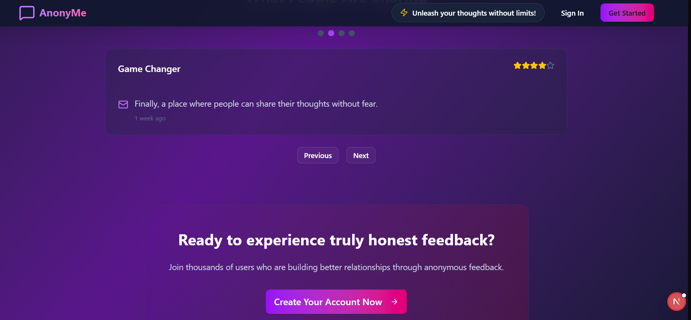
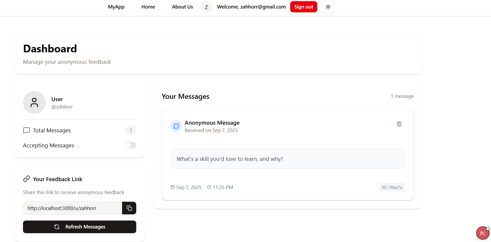

# Annoneme - Anonymous Feedback Platform

Annoneme is a full-stack anonymous messaging platform built with the Next.js, offering a secure and engaging space for users to share and receive feedback without revealing their identity. It leverages AI to enhance user interaction and provides a seamless, modern user experience.

## Key Features

- **Secure User Authentication**: Safe and secure sign-up and sign-in with email verification.
- **AI-Powered Suggestions**: Utilizes Google Gemini to generate creative and engaging questions to inspire conversations.
- **Anonymous Messaging**: Send and receive messages without revealing your identity, fostering open and honest communication.
- **Personalized Dashboard**: A dedicated space for users to view, manage, and delete their received messages.
- **Public Profile Pages**: Each user gets a unique public page (`/u/[username]`) where others can send them anonymous messages.
- **Real-time Username Validation**: Ensures all usernames are unique during the registration process.
- **Light & Dark Mode**: A sleek and modern UI with theme toggling for user comfort.

## Screenshots

| Sign In / Sign Up | Home Page |
| :---: | :---: |
|  |  |
|  |  |
|  |  |

| About Page | User Profile |
| :---: | :---: |
|  |  |
|  |  |
|  |  |


## Tech Stack

        

- **Framework**: [Next.js](https://nextjs.org/)
- **Language**: [TypeScript](https://www.typescriptlang.org/)
- **Styling**: [Tailwind CSS](https://tailwindcss.com/)
- **UI Components**: [shadcn/ui](https://ui.shadcn.com/)
- **Database**: [MongoDB](https://www.mongodb.com/) with [Mongoose](https://mongoosejs.com/)
- **Authentication**: [NextAuth.js](https://next-auth.js.org/)
- **AI Integration**: [Google Gemini](https://gemini.google.com/)
- **Schema Validation**: [Zod](https://zod.dev/)
- **Email**: [Resend](https://resend.com/) (Production) / [Nodemailer](https://nodemailer.com/) (Development)

## Getting Started

Follow these instructions to get a copy of the project up and running on your local machine.

### Prerequisites

- [Node.js](https://nodejs.org/en/) (v18 or later)
- [npm](https://www.npmjs.com/)
- A MongoDB database instance (e.g., [MongoDB Atlas](https://www.mongodb.com/cloud/atlas))

### Installation & Setup

1.  **Clone the repository:**
    ```bash
    git clone https://github.com/your-username/my-next-app.git
    cd my-next-app
    ```

2.  **Install dependencies:**
    ```bash
    npm install
    ```

3.  **Set up environment variables:**

    Create a `.env.local` file in the root of your project by copying the example file:
    ```bash
    cp .env.example .env.local
    ```

    Open `.env.local` and add the following required values:

    - `MONGODB_URI`: Your MongoDB connection string.
    - `NEXTAUTH_SECRET`: A secret for NextAuth.js. Generate one with `openssl rand -base64 32`.
    - `GEMINI_API_KEY`: Your API key for Google Gemini.
    - `RESEND_API_KEY`: Your API key for Resend if you want to use it for sending emails.


4.  **Run the development server:**
    ```bash
    npm run dev
    ```

5.  **Open the application:**

    Navigate to [http://localhost:3000](http://localhost:3000) in your browser to see the result.
